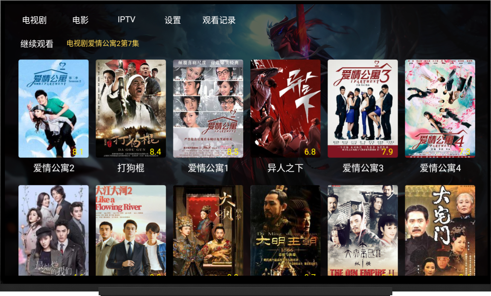
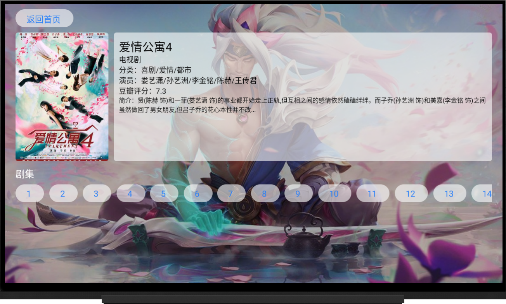
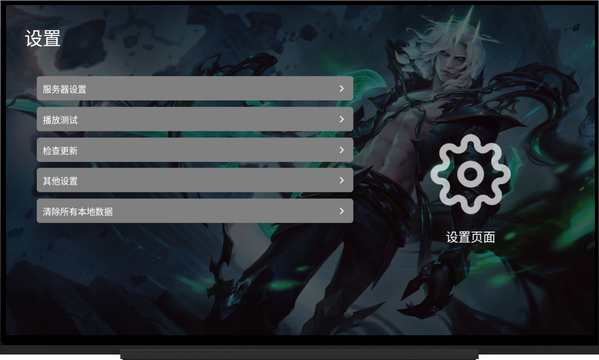

## 项目介绍

opentv安卓电视端软件，用于播放已经在后台添加了的影视资源

下一步准备重新设计页面，参考`ios`的`vidhub`页面设计和UI配色。

## 安装使用

请直接在右侧`发行版`中下载`apk`文件进行安装

## 开发任务

- [x] 安卓app端使用localstorage
- [x] 安卓app端优化快进方式   使用一个变量保存当前进度然后用另一个变量快进
- [x] 加入播放电影功能
- [ ] 安卓app加入观看历史功能
- [x] 安卓app优化设置页面
- [x] 增加上次观看的功能
- [ ] 加入转播电视台功能
- [ ] 组件化video、btn
- [ ] 完成设置功能 配置服务端地址、测试播放、清除缓存、恢复默认
- [ ] 继续观看跳转到上次的时间
- [ ] 删除lastView 改用history的第一个数据
- [ ] 想办法完成iptv页面
- [x] 修改APP图标及名称
- [x] 使用code-push线上更新
- [ ] 加入服务发现
## 好用的网站
- [安卓图标生成](https://makeappicon.com/) 
## code-push

